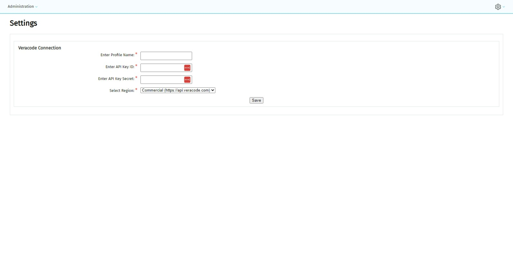
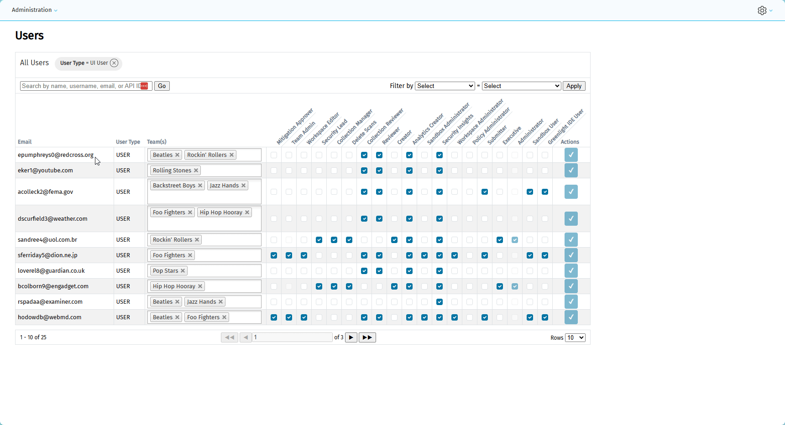
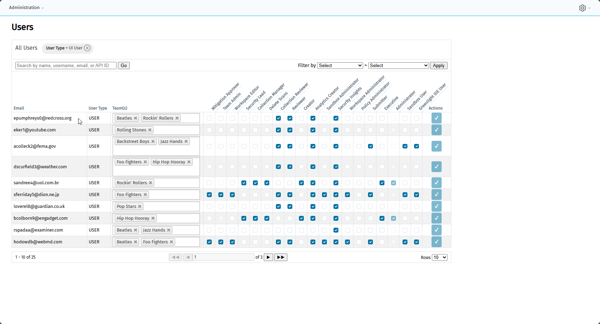
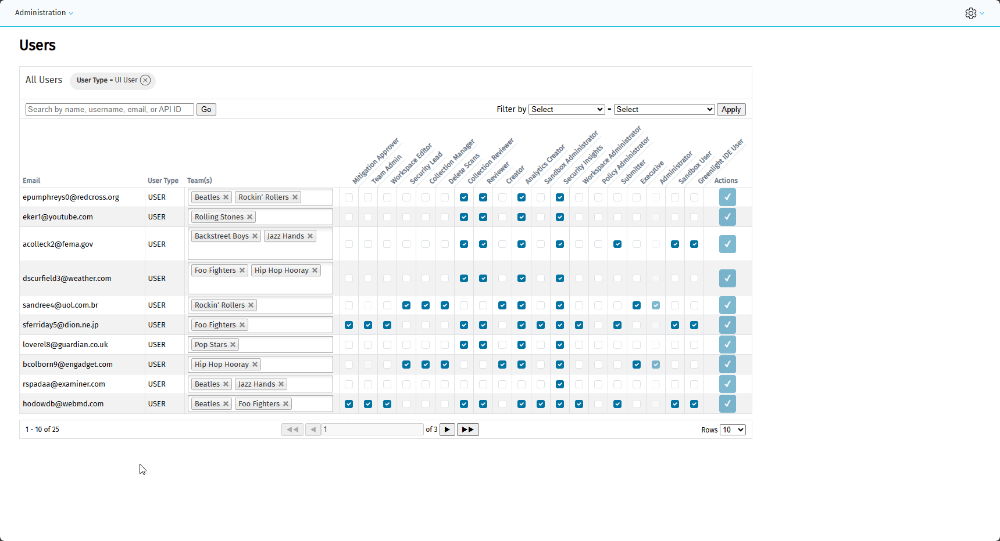

# Veracode Admin Plus
## 💡 About
```Veracode Admin Plus``` is a web application that runs locally on the user's device. It was built with the goal to make it easier for a Veracode administrator to manage the users in their instance.

## 📖 Basic User Guide
### Installation
1. Download the latest install files from the Releases page (⚠️Only the Windows/amd64 files are available at the moment. If you are using a different OS or architecture, you can build the application from source for your requirement or you can raise an issue)
2. Unzip the archive and move the **veracode_admin_plus** folder into this directory: ```<UserHomeDir>/.veracode/```. (You can ignore the **data** folder if you are not running the application in **Demo Mode**)
3. Optionally, you can add this path: ```<UserHomeDir>/.veracode/veracode_admin_plus/bin``` to your PATH variable so that you can start the application from cmd without specifying the full path.

### Starting The Application
You can start the application by running the executable from the command line or by double-clicking on it from your file explorer. Once it starts, the web portal will open in a new tab, with a random open port, in your default browser.

To stop the application, you can click on **Shutdown** in the portal or you can interrupt the process in the terminal (```CTRL+C```).

### Configuration
```Veracode Admin Plus``` uses a [Veracode credentials file](https://docs.veracode.com/r/c_api_credentials3#about-the-api-credentials-file) in the same way as the other Veracode utilities. This means that you don't have to maintain credentials in multiple places. 

The application's configurations are stored at: ```<UserHomeDir>/.veracode/veracode_admin_plus/config.yaml```.

The first time you start the application, it will check if the credentials file and config files are in place. If they are not present, you will be directed to the **Settings** page where you can enter your API credentials (If you don't know how to generate your API credentials, click [here](https://docs.veracode.com/r/c_api_credentials3#generate-api-credentials)) and configure the application.



> [!NOTE]
> If you need to administrate multiple Veracode instances across different regions, the application does support region and credentials profile switching. This can be done from the **Settings** page. 

### Updating A User
1. If you are not on the **Users** page already, navigate to Administration > Users in the nav bar.
2. From the **Users** page, you can assign users to teams, set their permissions and once you are done, click on the submit button in the **Actions** column:



The application supports setting which teams the user can govern if they have the **Team Admin** role. It also supports setting which Scan Types the user has access to:



### Switching Between API & UI Users
The UI and API users are separated, because they have different roles and I didn't want to put it all in one table. To switch between the UI- and API user tables, click on the delete filter button in the **User Type** filter pill in the filters band:



### Demo Mode
If the GIFs aren't enough and you want to admire my handy-work up close, then you can download and run the application in **Demo Mode** with mock data. To do so, copy folder: ```<Install Files>/data/demo``` into folder: ```<UserHomeDir>/.veracode/veracode_admin_plus/data``` before starting the application.

## 🥞 Tech Stack
### Frontend
- The UI is built with Vanilla HTML, CSS and Javascript/JQuery.
- In ```v1``` I used [html/template](https://pkg.go.dev/html/template) for template-ing, but in ```v2``` I rebuilt all of the template-ing in [a-h/templ](https://github.com/a-h/templ).
- In ```v2``` I have removed AlpineJS and Hyperscript. I will probably revisit AlpineJS in a later version.
- HTMX handles all of the client-side reactivity.
### Backend
- On the backend I am using [chi](https://github.com/go-chi/chi) for the web server.
- I am using my Veracode API SDK, [veracode-go](https://github.com/DanCreative/veracode-go), to communicate with the Veracode APIs.

## 📈 Upcoming Releases
### Version ```v2.1.0```
- Grouping roles into groups that can be added to users instead of setting roles one-by-one.
- Managing Teams and Business Units.
- Gracefully shutdown the application as well as a shutdown button on the frontend.
### Version ```v2.2.0```
- Select multiple users and bulk assign a role group to them.
### Further Ahead
- Create a Github Action workflow to handle SemVer bumping and application building. (For now I have created a build task in the Taskfile)
- Bulk create/update Application Profiles and Collections.