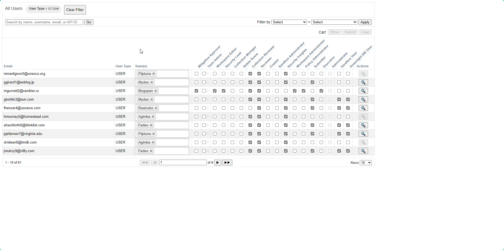
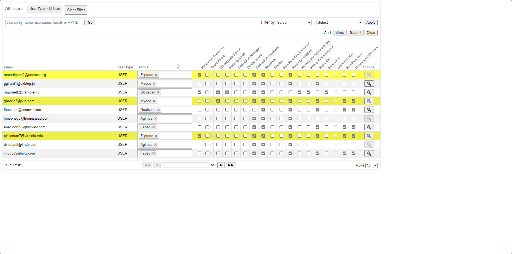
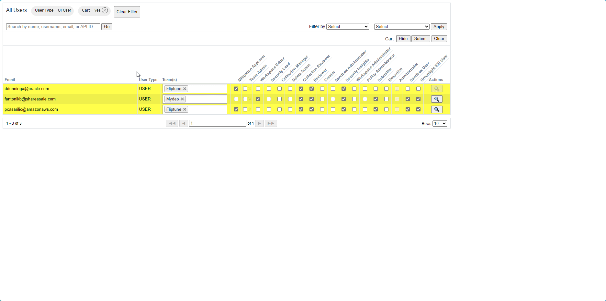

# veracode-admin-plus
**Veracode Admin Plus** is a local web application utility. It is intended to make the life of a Veracode administrator easier, by dramatically speeding up the process of updating multiple users' permissions. 

Make changes to one or more users | Optionally view all of the changes | Submit all of the changes
:--:|:--:|:--:
 |  | 

## Features
- **It's fast:** Asynchronously fetches and updates users. (Also its a GO application😉)
- **Filtering:** All filtering available on the official Veracode UI, is available in this utility.

## Getting Started
### Installation
0. Download and install go from: https://go.dev/doc/install
1. Open a terminal and run command: ```go install -o vap.exe```

### Configuration
1. **Veracode Admin Plus** makes use of the same Veracode API credential file pattern that the other Veracode utilities use. This is handy, because it means that you can manage all of your API credentials in the same place. Please follow the Veracode documentation to create a new API credentials file if you don't have one already ([Windows](https://docs.veracode.com/r/t_configure_credentials_windows)/[macOS or Linux](https://docs.veracode.com/r/t_configure_credentials_mac)).
2. If you have more than one profile, you can set the ```VERACODE_API_PROFILE``` environment variable to switch between them. This works in the same way as the HTTPie Veracode authentication library's [multipe profiles](https://docs.veracode.com/r/c_httpie_tool#using-multiple-profiles) feature.